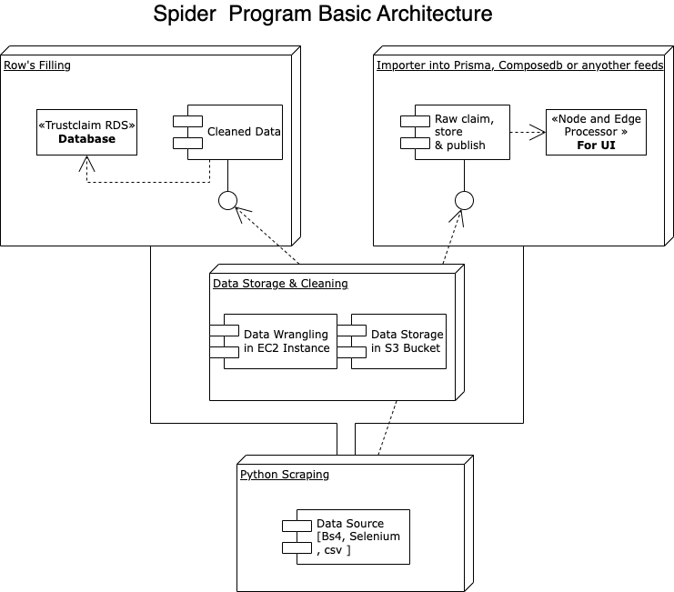

# Spider Prod Repo

python code to run separate steps of the pipeline, and later maybe to orchestrate

1) spider and save raw data to be turned into claims

2) clean and normalize the data into an importable format

3) import into signed claims (signed by our spider)

That's all the import data pipeline

Then

4) dedupe, parse and decorate claims into nodes and edges

The nodes and edges will be used to feed the front end views

## Basic Program Architecture
